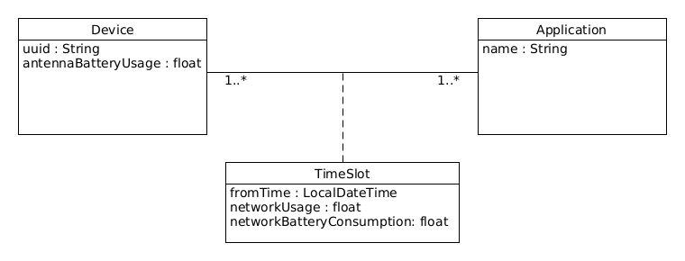

# Hermes App

### Σύντομη περιγραφή

Στα πλαίσια της εργασίας θα υλοποιήσουμε μια εφαρμογή για  android, η  οποία θα συλλέγει δεδομένα για την κίνηση δικτύου και την κατανάλωση ενέργειας. Πολλές φορές γίνεται αλόγιστη κατανάλωση της μπαταρίας της συσκευής ή του bandwidth του δικτύου από ορισμένες εφαρμογές. Η εφαρμογή θα προσφέρει στον χρήστη την δυνατότητα να παρακολουθεί την χρήση του δικτύου και της μπαταρίας ανά εφαρμογή και θα αποθηκεύει τα δεδομένα σε έναν server ώστε να προσφέρεται πρόσβαση στα δεδομένα και από άλλους χρήστες.

### Υλοποίηση

Η εφαρμογή θα προβάλει στον χρήστη ταξινομημένες ανά κίνηση δικτύου τις εφαρμογές του κινητού. Ο χρήστης θα έχει την δυνατότητα να αλλάξει τον τρόπο της ταξινόμησης μέσω της διεπαφής. Με τον ίδιο τρόπο, ο χρήστης θα μπορεί να δει την κατανάλωση της μπαταρίας ανά εφαρμογή. Ακόμα, ο χρήστης θα μπορεί να επιλέξει την χρονική περίοδο των δεδομένων που προβάλλονται, μεταβάλλοντας τις ρυθμίσεις ενός μενού. Επιπροσθέτως, η εφαρμογή θα διαθέτει tabs για το δίκτυο ή την μπαταρία ανά εφαρμογή, όπου ο χρήστης θα μπορεί να δει γενικές πληροφορίες για την κάθε εφαργογή αναξαρτήτως της συγκεκριμένης συσκευής. Η εφαρμογή θα μπορεί, επιπλέον, να φτάνει και σε συμπεράσματα, συνδυάζοντας τα συγκεντρωμένα στοιχεία του server. Για παράδειγμα, θα μπορούσε να υπολογίζει την κατανάλωση ενέργειας ανά MB για μία εφαρμογή.

Η εφαρμογή θα αποστέλει ανά τακτά χρονικά διαστήματα τα δεδομένα για την συγκεκριμένη συσκευή στον server, ο οποίος θα τα αποθηκεύει και θα τα επεξεργάζεται. Η βάση δεδομένων του server θα υλοποιηθεί με [PostgreSQL](https://www.postgresql.org/), ενώ ο ίδιος ο server θα κατασκευαστεί πάνω στο [Java Spring framework](https://spring.io/projects/spring-framework). Ο server θα λειτουργεί ως ένα API που διαθέτει τα δεδομένα του σε εφαρμογές-πελάτες.

### Λειτουργικές απαιτήσεις

1. Η εφαρμογή προβάλει την κίνηση δικτύου των εφαρμογών του κινητού.
2. Η εφαρμογή προβάλει την κατανάλωση της μπαταρίας των εφαρμογών του κινητού.
3. Η εφαρμογή προβάλει γενικές πληροφορίες για κάθε εφαρμογή ανεξαρτήτως της συγκεκριμένης συσκευής.
4. Η εφαρμογή στέλνει δεδομένα σχετικά με την χρήση του δικτύου και την κατανάλωση της μπαταρίας στον server.
5. Οι γενικές πληροφορίες υπολογίζονται και αποθηκεύονται από τον backend server του συστήματος.
6. Η εφαρμογή λαμβάνει τα αποτελέσματα του server.
7. H εφαρμογή λαμβάνει συνδυαστικά δεδομένα από τον server.

### Διάγραμμα περιπτώσεων χρήσης

### Περιπτώσεις χρήσης

##### ΠΧ1 - Άνοιγμα Εφαρμογής

##### ΠΧ2 - Προβολή Κίνησης Δικτύου

##### ΠΧ3 - Προβολή Κατανάλωσης Μπαταρίας

##### ΠΧ4 - Προβολή Γενικών Πληροφοριών Δικτύου

##### ΠΧ5 - Προβολή Γενικών Πληροφοριών Μπαταρίας

##### ΠΧ6 - Προβολή Συνδυαστικών Δεδομένων

##### ΠΧ7 - Επεξεργασία & Αποθήκευση Στοιχείων

##### ΠΧ8 - Υπολογισμός & Αποστολή Στοιχείων

##### ΠΧ9 - Επεξεργασία & Αποστολή Συνδυαστικών Δεδομένων

### Μοντέλο πεδίου

#### Διάγραμμα μοντέλου πεδίου

#### Διαγράμματα ακολουθίας

##### ΠΧ1

